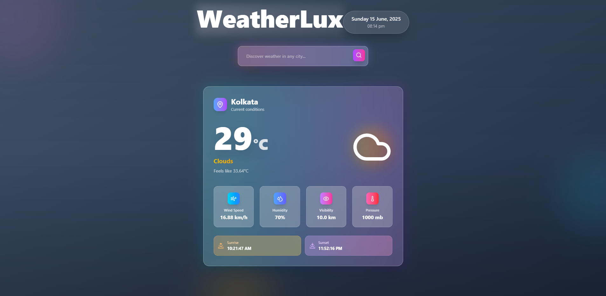
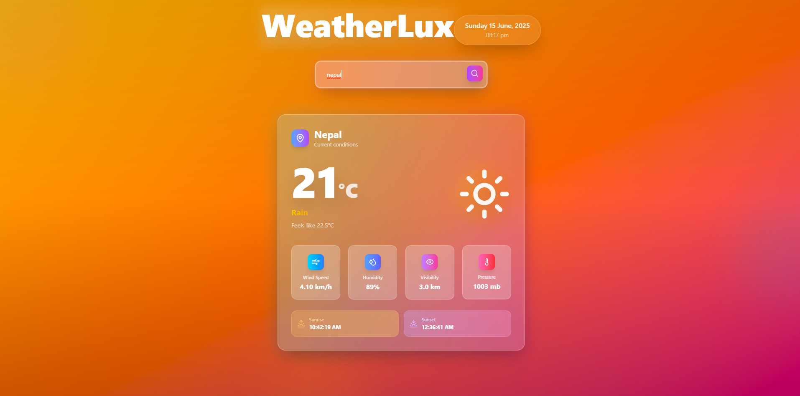
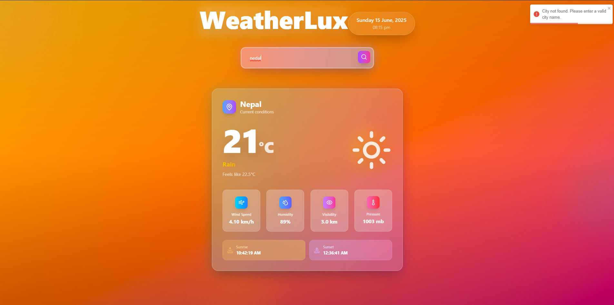

# 🌤️ Current Weather App

A sleek and responsive real-time weather application built using **React**, **Tailwind CSS**, and the **OpenWeatherMap API**. It allows users to search for any city and view current weather conditions, temperature, humidity, wind speed, sunrise/sunset times, and more — all with smooth UI effects and toast notifications.


---

## 🚀 Features

- 🔎 **Smart City Search** - Search weather by city name with auto-suggestions
- 🌡️ **Comprehensive Weather Data**:
  - Current **temperature** with real-time updates
  - **Feels like** temperature for accurate comfort level
  - Weather **condition** (Clouds, Rain, Clear, etc.)
  - **Humidity** and **atmospheric pressure**
  - **Wind speed** and **visibility** metrics
  - **Sunrise** and **sunset** times (local timezone)
- 🎨 **Dynamic UI Effects**:
  - Weather-based **background gradients**
  - Animated **weather icons** that match conditions
  - Floating **particles effect** for immersive experience
- 🔔 **Smart Notifications**:
  - **Toast error messages** for invalid searches
  - Success indicators for successful data fetching
- 🌀 **Smooth User Experience**:
  - Loading indicators while fetching data
  - Responsive design for all device sizes
  - Fast performance with optimized API calls

---

## 🛠️ Tech Stack

| Technology      | Usage                        | Version |
|-----------------|------------------------------|---------|
| React.js        | Frontend framework           | ^18.0.0 |
| Tailwind CSS    | Utility-first styling        | ^3.0.0  |
| OpenWeatherMap  | Weather data API             | v2.5    |
| React Toastify  | Toast notifications          | ^9.0.0  |
| Vite            | Development & build tool     | ^4.0.0  |

---

## 📸 Screenshots

### 🏠 Main Interface


### 🔍 Search Functionality


### ❌ Error Handling


---

## 📦 Installation & Setup

### Prerequisites
- Node.js (v16 or higher)
- npm or yarn package manager
- OpenWeatherMap API key

### 1. Clone the Repository
```bash
git clone https://github.com/your-username/weather-app.git
cd weather-app
```

### 2. Install Dependencies
```bash
npm install
# or
yarn install
```

### 3. Environment Configuration
Create a `.env` file in the root directory:
```env
VITE_APP_ID=your_openweathermap_api_key
VITE_API_URL=https://api.openweathermap.org/data/2.5
```

📌 **Get your API key**: Visit [OpenWeatherMap API](https://openweathermap.org/api) and sign up for a free account

### 4. Run the Development Server
```bash
npm run dev
# or
yarn dev
```

Visit `http://localhost:5173` in your browser to see the app in action!

### 5. Build for Production
```bash
npm run build
# or
yarn build
```

---

## 📁 Project Structure

```
weather-app/
│
├── public/
│   ├── vite.svg
│   └── index.html
│
├── src/
│   ├── components/
│   │   ├── Weather.jsx         # Main weather component
│   │   
│   ├── assets/
│   │   └── icons/             # Weather icons
│   │    
│   ├── App.jsx                # Root component
│   ├── main.jsx               # Application entry point
│   └── index.css              # Tailwind base styles
│
├── .env                       # Environment variables
├── .gitignore
├── package.json
├── tailwind.config.js
├── vite.config.js
└── README.md
```

---

## 🚀 Deployment

### Deploy to Vercel
```bash
npm install -g vercel
vercel --prod
```

### Deploy to Netlify
```bash
npm run build
# Upload dist/ folder to Netlify
```

### Environment Variables for Production
Remember to add your environment variables in your deployment platform:
- `VITE_APP_ID`: Your OpenWeatherMap API key
- `VITE_API_URL`: API base URL

---

## 🔧 Future Enhancements

### Planned Features
- 🌎 **Geolocation**: Get weather for current location
- 🌓 **Theme Toggle**: Dark/light mode switch
- 🌡️ **Unit Conversion**: Celsius ↔ Fahrenheit toggle
- 📊 **Extended Forecast**: 7-day weather forecast
- 📈 **Weather Charts**: Hourly temperature/precipitation graphs
- 🌐 **Internationalization**: Multi-language support (Bengali, Hindi, Spanish)
- 📱 **PWA Features**: Offline support and push notifications
- 🗺️ **Weather Maps**: Interactive weather radar
- 📊 **Weather Analytics**: Historical weather data visualization

### Contributing
1. Fork the repository
2. Create a feature branch: `git checkout -b feature/new-feature`
3. Commit changes: `git commit -m 'Add new feature'`
4. Push to branch: `git push origin feature/new-feature`
5. Submit a pull request

---

## 🙌 Acknowledgements

Special thanks to the amazing tools and services that made this project possible:

- [OpenWeatherMap](https://openweathermap.org/) - Reliable weather data API
- [React](https://reactjs.org/) - Powerful frontend framework
- [Tailwind CSS](https://tailwindcss.com/) - Utility-first CSS framework
- [React Toastify](https://fkhadra.github.io/react-toastify/) - Beautiful toast notifications
- [Vite](https://vitejs.dev/) - Lightning-fast build tool
- [Lucide Icons](https://lucide.dev/) - Beautiful weather icons

---

## 👨‍💻 Author

**Made with ❤️ by [Santanu Raj]**

- 🔗 **LinkedIn**: [linkedin.com/in/your-profile](https://linkedin.com/in/santanu-raj)
- 🐙 **GitHub**: [github.com/santanuraj0101](https://github.com/santanu0101)
- 🌐 **Portfolio**: [My-portfolio.com](https://santanu-raj.vercel.app/)
- 📧 **Email**: santanuraj75@gmail.com

---

## 🌟 Show Your Support

If this project helped you, please consider:
- ⭐ **Star this repository**
- 🍴 **Fork it for your own projects**
- 🐛 **Report bugs** via Issues
- 💡 **Suggest new features**
- 📢 **Share it with others**

---

<div align="center">

### 🌤️ Stay Updated with the Weather! 🌤️

**[Live Demo](https://your-weather-app.vercel.app)** | **[Report Bug](https://github.com/your-username/weather-app/issues)** | **[Request Feature](https://github.com/your-username/weather-app/issues)**

---

*Built with React + Tailwind CSS + OpenWeatherMap API*

</div>